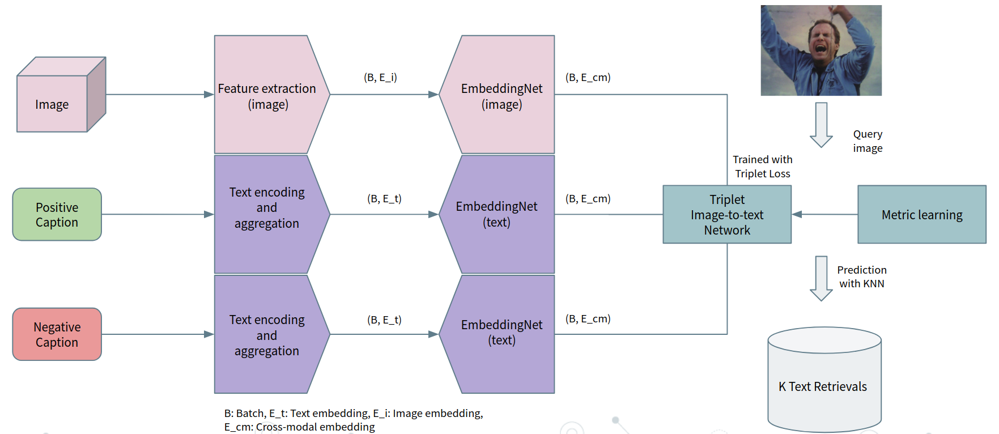
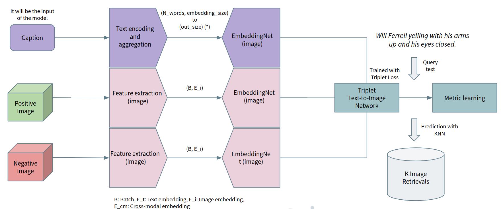
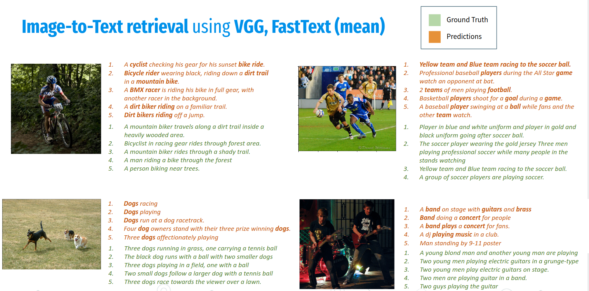
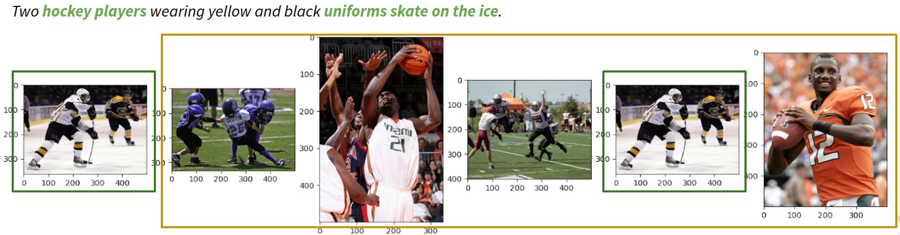
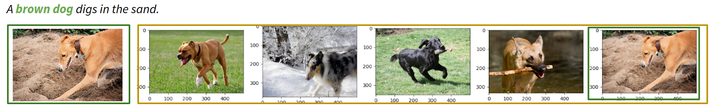

# Cross Modal retrieval Implementation
| Members                       | Contact | GitHub |
|:------------------------------|   :---    |   :---    |
| Igor Ugarte Molinet           | igorugarte.cvm@gmail.com | [igorugarteCVM](https://github.com/igorugarteCVM) | 
| Juan Antonio Rodríguez García | juanantonio.rodriguez@upf.edu  | [joanrod](https://github.com/joanrod) |
| Francesc Net Barnés           | francescnet@gmail.com  | [cesc47](https://github.com/cesc47) |
| David Serrano Lozano          | 99d.serrano@gmail.com | [davidserra9](https://github.com/davidserra9) |


## Introduction
The objective of this repository is to face the problem of metric learning in the context of cross modal retrieval.

This problem is posed as constructing a latent space where pairs of images and text captions are projected, following a similarity metric.
For this purpose, feature embeddings are computed from both the images and the text captions. The embeddings are then projected into a latent space, and the similarity between the embeddings is computed.
For images, we use CNN features obtained using VGG and Faster RCNN. For text, we use the pre-trained word embeddings from the FastText project, as well as the ones from BERT.
The approach uses metric learning in a Triplet-fashion, where the triplet loss is used to learn the embeddings of the images and the text captions. Furthermore, Image-to-Text and Text-to-Image retrieval are performed (using two separate models).

### Dataset
The dataset that will be used for this experiment is Flickr30k dataset. The Flickr30 dataset, Young et al, consists of 31.783 images and 158.915 text captions, 5 captions per image. Images with a high variety of scenes and conditions (in-the-wild).
One instance of the dataset is a pair of image and a random caption from the set of 5.

* **Train**: 29000 instances
* **Val**: 1014 instances
* **Test**: 1000 instances

The dataset is avaliable at: https://www.kaggle.com/datasets/hsankesara/flickr-image-dataset

### Evaluation
What we have implemented to evaluate our models is **mAP@k**: Mean Average Precision @ k. This metric normalizes over the found true positives, and accounts if TP are in the correct order.

### Cross modal retrieval implementation
Two schemes are implemented (triplet learning architecture): Image-to-Text retrieval & Text-to-Image retrieval, we hope that are comprehensible enough to be used for further research.
##### Image-to-Text retrieval


##### Text-to-image retrieval


## Quick Start Examples
To run the experiments, we first use a simple script to unify the given features (VGG and FastText) and define train, val and test splits.
```
$ python src/manage_Flickr_dataset.py
```

Then, we run the experiments. {task_info} is a string that contains the information about the task.
```
$ python src/task_{id_task}_{task_info}.py
```
### Results
In this section we show the results of the experiments, all of them can be runned using the script above, using the correct id_task and task_info.

#### Image-to-Text retrieval using VGG, FastText and BERT
We project VGG and textual features to the same space using MLP (Linear layers, PRelu and Dropout). We perform textual aggregation using mean and sum over the embeddings. BERT is a model based on bi-directional transformers designed to encode the context of the sentence in the CLS token, in the first position.
In the following image it can be seen the qualitative results for the Image-to-Text retrieval using VGG as a visual feature extractor and FastText as a textual feature extractor:



#### Text-to-Image with VGG features
We use the same linear projections for the image features and text embeddings, and reuse the defined hyperparameters. As before, we perform experiments with FastText and BERT language models
This is a much difficult problem, because now there is just one correct image retrieval for each text, and the results show also this behaviour. While not being very acceptable, both tasks perform relatively similar.
The system that we provide, is capable of capturing high level semantics, but is not sufficient to catch detailed information. 

In the following images it can be seen the qualitative results for the Text-to-Image retrieval using VGG as a visual feature extractor and BERT as a textual feature extractor, sorting the retrievals of our model by order:






## Documentation
A paper in the CVPR format corresponding to all the tasks and experiments devoted to Cross-modal retrieval have been written by us. It is available at: [Paper]([https://www.overleaf.com/5374743577rshpmzsgynjj](https://github.com/cesc47/cross-modal-retrieval-with-triplet-network/blob/main/Cross-Modal-Retrieval-Triplet.pdf))

## Final discussion about the results
Quantitative results with map are rather poor because the method is not able to catch the details in the image and text semantics. Also there are a lot of candidate retrievals that are plausible.
We are able to obtain satisfactory qualitative results with VGG and using BERT or FastText. We see that the relevant and high level concepts are captured, but details for a good retrieval are lost.
Failed experiments: Faster R-CNN embeddings, LSTM FastText aggregation, Resnet50 finetune, VQVAE+BERT, Common Triplet MLP
Most of our experiments are unsatisfactory, where the Triplet Loss collapses all instances to a single point, hence returns random retrievals

## References
[1] Peter Young, Alice Lai, Micah Hodosh, Julia Hockenmaier; From image descriptions to visual denotations: New similarity metrics for semantic inference over event descriptions. Transactions of the Association for Computational Linguistics 2014; 2 67–78. doi: https://doi.org/10.1162/tacl_a_00166
